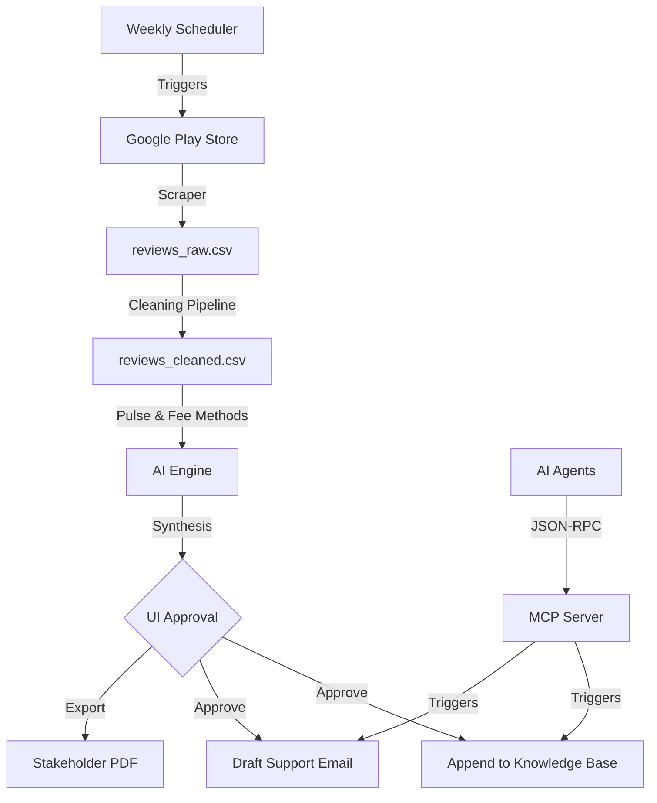

# AI Workflow Architecture: Weekly Product Pulse

This architecture integrates **actual Google Play reviews**, **high-performance LLM logic**, and a **weekly automated scheduler**.

---

## 1. Simplified Core Stack
- **Data Gathering**: `google-play-scraper` (Scraping `in.indwealth` latest 1000 reviews).
- **AI Engine**: **Llama 3.1 LLM** 
    - **Pulse**: `llama-3.1-8b-instant` (Optimized for speed/stability in free tier)
    - **Fee Explainer**: `llama-3.1-8b-instant` (Fast, structured facts)
- **Orchestration**: Python (Pandas) + Modular Stage folders.
- **Frontend**: Streamlit (Premium Centered Dashboard).
- **MCP Protocol**: `FastMCP` (via `mcp_server.py`).
- **Scheduler**: Local Cron / GitHub Actions.

---

## 2. Phase-wise Detail (V2)

### Stage 1: Actual Review Scraper
- **Tool**: `google-play-scraper`.
- **Constraint**: Download the latest **1000 reviews** from INDmoney Play Store.
- **Filtering**: Retain only reviews from the **last 8–12 weeks**.

### Stage 2: Data Preprocessing & Sanitization
- **Cleaners**:
    - **Length-Guard**: Remove reviews with **fewer than 5 words**.
    - **Title-Scrub**: Remove user titles as they add redundant noise.
    - **Language-Filter**: Remove non-English reviews using ASCII-detection.
- **PII Scrubbing**: Regex-based replacement of emails, phone numbers, and unique IDs.

### Stage 3: AI Intelligence
- **Part A (Pulse)**:
    - Task: Synthesize 5 themes, identify Top 3, and extract 3 detailed representative quotes from reviews.
    - Model: `llama-3.1-8b-instant` (Batch size: 40 critical reviews).
- **Part B (Fee Explainer)**:
    - Task: Neutral, 6-bullet explanation for "Exit Load" or "Brokerage".
    - Model: `llama-3.1-8b-instant`.

### Stage 4: Email Delivery & Action Layer
- **HITL Verification**: Visual dashboard review of all generated sections.
- **Email Delivery**:
    - **Multipart Format**: HTML (Markdown-rendered) and Plain Text versions.
    - **Storage**: Saved as `.eml` drafts in `outputs/email_drafts/`.
    - **SMTP Sending**: Support for actual SMTP delivery via `.env` credentials.
- **MCP Tools**: 
    - `Append to Master Notes`: Logs results to `MASTER_NOTES.md`.
    - `Generate One-Pager`: Stakeholder PDF export.

### Stage 5: Weekly Scheduler & Automation
- **Frequency**: Every Week (Specific Day at 3:35 PM IST).
- **Recipient**: `codeflex16@gmail.com`.
- **Logs**: Dedicated `outputs/scheduler_logs.csv` to track execution history and success rates.

### Stage 6: Formal MCP Server (Standardized Tools)
- **Framework**: `FastMCP`.
- **Entry Point**: `mcp_server.py`.
- **Exposed Tools**:
    - `log_to_master_notes`: Standardized tool for updating the knowledge base.
    - `create_report_email`: Standardized tool for drafting stakeholder communications.
    - `check_workflow_status`: Diagnostics tool for environment health.
- **Integration**: Allows any MCP-compatible client (e.g., Claude Desktop) to trigger INDmoney report actions via JSON-RPC.

---

## 3. Data Flow Diagram

---

## 4. Security & Ethics
- **Approval-Gated**: All actions (Saving notes, drafting emails) require manual click.
- **PII Scrubbing**: Applied globally before any data reaches the LLM.
- **Neutral Tone**: Prompts enforce a facts-only approach for fee explanations.
